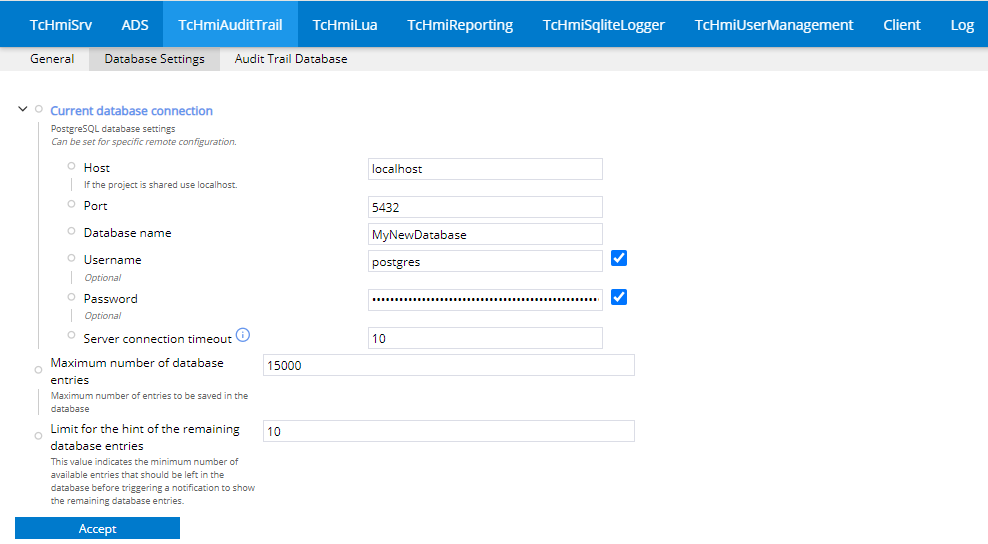
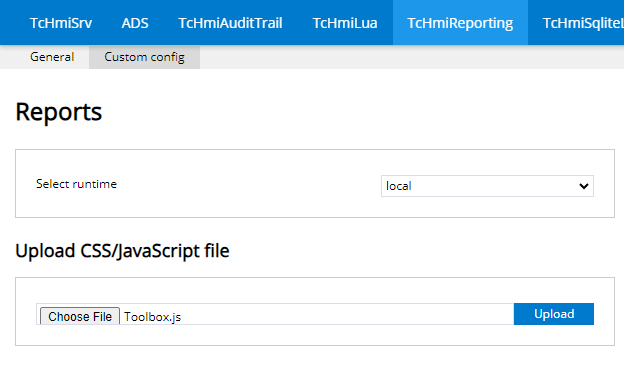
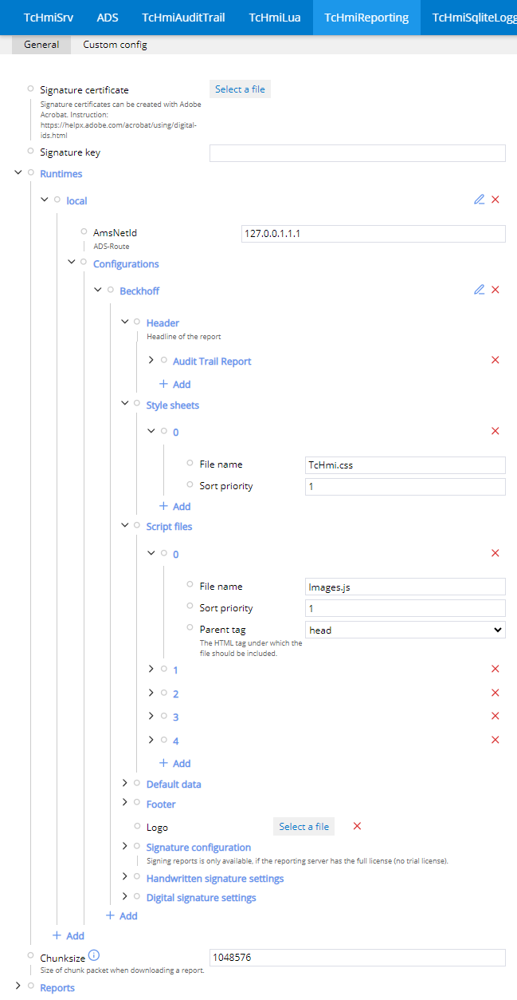

# AuditTrailReporting

This sample demonstrates how to configure the TcHmiReporting extension in combination with the TcHmiAuditTrail Extension.

## Prerequisites

To get this sample running, you will also need:

- `TwinCAT.XAR.ReportingServer` package
- A PostgresSQL database (e.g,. pgAdmin4)

The `TwinCAT.XAR.ReportingServer` package can be installed via the TwinCAT Package Manager. A PostgreSQL database can be set up by installing pgAdmin4 and creating a database there.

## AuditTrail Configuration

First, you need to establish a connection to your PostgreSQL database. You can find the database settings on the config page under the tab TcHmiAuditTrail > Database Settings. Fill in the information according to your database. If you're running pgAdmin4 on your system, you can leave Host and Port as `localhost` and `5432`. Fill in the name of your created database and the user credentials. After accepting the input, the Diagnostics should show `PostgreSQL System Connected` in the connection state.



You can now add symbols and Events you want to audit in the general tab.


## Reporting Configuration

To get your reporting extension running, you first need to make sure your reporting server is running. Then upload the scripts and the stylesheet from the `ReportingSources` folder in the repository to the reporting server. To do that, open the config page of your HMI and go to the TcHmiReporting > Custom config tab. Under `Upload CSS/JavaScript file`, you can select and upload the files from the `ReportingSources` folder one by one. These files are needed to create the audit trail report.



Now you can configure the runtime and the appearance of the report. This is already done in the sample. If you want to define a new runtime/report appearance, you should start by adding a new runtime. In the runtime, you can define the ADS-Route and configurations for the report. The configuration defines, among other things, parts of the report such as the header or footer and the sources that are used to create the report, including the files we uploaded to the reporting server. Each file has to be defined here separately:



The appearance of the report can be configured under `Reports`. You can create multiple configurations here. A configuration defines the runtime and the runtime configuration and lets you define `Tables`, `Text fields`, and `HTML containers`. Each lets you define a symbol that provides the data handled in the corresponding element. In our case, it's the `TcHmiAuditTrail.GetAuditTrail` symbol, as we want to create a report on the audit trail data. In our sample, the `Text fields` are used to fill the report with content. Each of the four elements defines its contents via the `value` property, which allows you to define the content as HTML. You can therefore also use JavaScript there, as script tags are allowed.

Here's an example of a `value` definition that creates a list of audit trail entries. It uses the uploaded scripts and styles:

``` HTML
<div class="auditEntries">
</div>
<script>
    let audiTrail;
    (function (AudiTrail) {
        var parentElement = document.querySelector(".auditEntries");
        try{
          let toolbox = new Reporting.Toolbox.Element();

          // The value will be replaced while loading.
          let jsValue = {value};
          let sortedValue = jsValue.sort((data1, data2) => (data1.timestamp > data2.timestamp) ? 1 : (data1.timestamp < data2.timestamp) ? -1 : 0);
          toolbox.createEntries(parentElement, sortedValue);
        }
        catch (err) {
          parentElement.innerHTML = `Create main error: <br>` + err;
        }
    })(audiTrail);
</script>
```

## Create Report

If the TcHmiReporting extension was set up correctly, you can create a report under the TcHmiReporting > Custom config tab by selecting your configured runtime and report configuration and clicking the `Create` button to order a report. If the report was created successfully, it will be displayed below.
