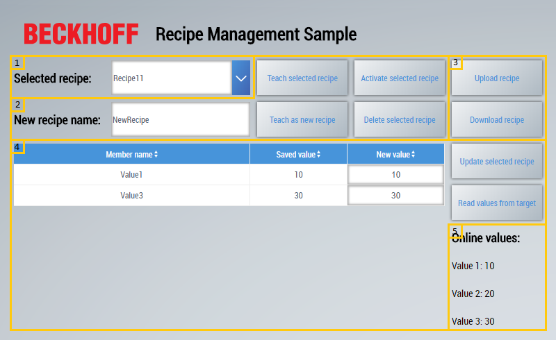

# RecipeManagement

This recipe management example shows the use of the recipe management at runtime. It thereby extends the functions available in the Actions and Conditions Editor by the use of the Framework API. The example serves as the point of entry to the recipe management and can be extended as desired. In parallel with the example project, observe the chapter [Management in the engineering](https://infosys.beckhoff.com/content/1033/te2000_tc3_hmi_engineering/5737061387.html?id=14175300647116079) in Infosys.

The example consists of a TwinCAT HMI project and a TwinCAT project with example symbols in the PLC. The example contains a total of three symbols, which are used by two different recipe types. Symbol 1 and Symbol 2 are the symbols from the PLC and Symbol 3 is an offline symbol. The offline symbol illustrates that symbols from other sources (OPC UA, use-specific server extension, etc.) can also be used as the ADS extension.

## User interface

The example has a user interface in the client that can execute various functions of the recipe management at runtime. These are described in more detail below.

1. Recipe selection: All available recipe types are displayed in the combo box. If there is a recipe inside a folder, the relative path to the recipe is displayed. The combo box is used to select the recipe that is used as the basis for the other buttons and fields in this example.

2. Teach and activate recipe: The recipe currently selected in the combo box can be edited in this area.
   * Teach selected recipe: The currently selected recipe is taught again. This means that the current online values are adopted from the PLC and saved in the recipe.
   * Teach as new recipe: A new recipe is created with the current online values from the PLC on the basis of the currently selected recipe. A new name for the recipe must be entered in the text box.
   * Activate selected recipe: The currently selected recipe is activated. This means that the values stored in the recipe are written to the corresponding symbols in the PLC.
   * Delete selected recipe: The currently selected recipe is deleted.
  
3. Upload and download recipe: This area enables recipes to be downloaded and uploaded. The file browser of the respective browser that enables the selection of the storage location or the selection of the recipe thereby opens.

   *Note*: The upload and download functions are not available in the LiveView in Visual Studio.

4. Display and edit recipe: This area enables the display and editing of the recipe members (symbols) of the currently selected recipe.

   * Datagrid: The currently selected recipe is loaded and the individual members are displayed in the data grid. The "New value" column has two different functions. Firstly, the column is used to receive new values for the individual members of the recipe, which are subsequently saved by clicking on the Update selected recipe button. Secondly, the column is used to display the current online values of the members for comparison with the stored values by clicking on the Read values from target button.
   * Update selected recipe: This button saves the recipe with the new values specified in the "New value" column.
   * Read values from target: This button reads out the current online values of the recipe members and displays them in the "New value" column.

5. Online recipe values: The current online values of the three symbols Value 1, Value 2 and Value 3 are displayed in this area.

## Further Information

* [Logic in the background](https://infosys.beckhoff.com/content/1033/te2000_tc3_hmi_engineering/5872675083.html?id=1883451105835014634) (Documentation in Infosys)
* [Extension with filter function](../RecipeManagementFilter/README.md)
