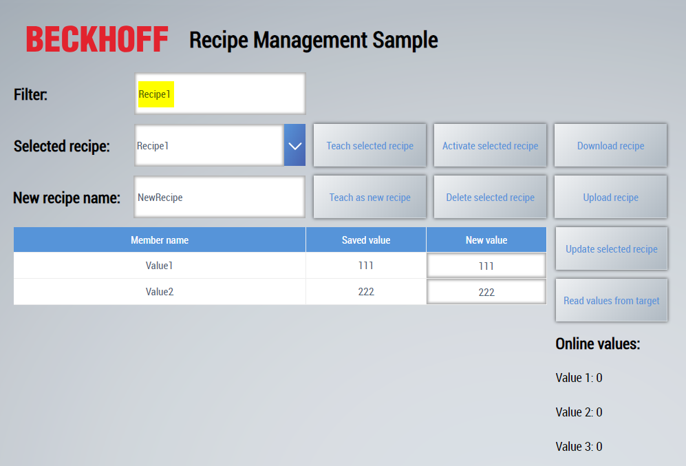

# RecipeManagement Extension with filter function

The sample is the [base example](../RecipeManagement/README.md) extended by a filter function that filters the list of recipes based on the recipe name.

## User interface

## Further Information

* [Logic in the background](https://infosys.beckhoff.com/content/1033/te2000_tc3_hmi_engineering/5872675083.html?id=1883451105835014634) (Documentation in Infosys)
* [Extension with filter function](../RecipeManagementFilter/README.md)
