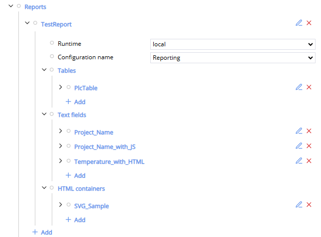
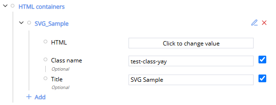
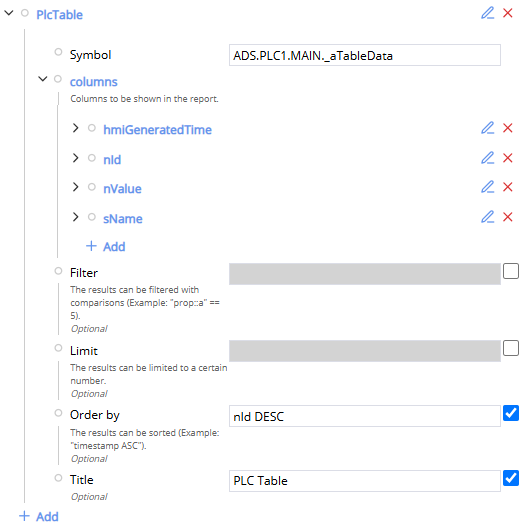
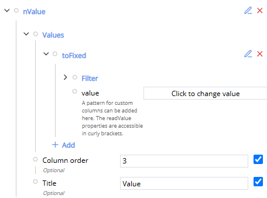
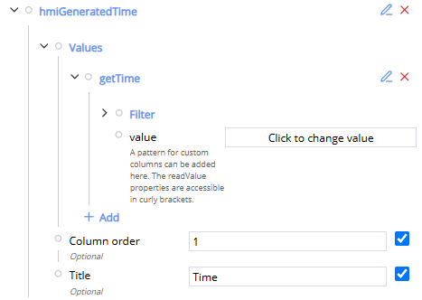

# ReportingExample

This sample demonstrates how to configure the TcHmiReporting extension and how to configure different content elements like textfields, tables and HTML containers in the created report.

## Prerequisites

To get this sample running, you will also need:

- `TwinCAT.XAR.ReportingServer` package
- `Tc2_Standard` package
- `Tc2_System` package
- `Tc3_Module` package
- `Tc2_ControllerToolbox` package

The packages can be installed via the TwinCAT Package Manager.

## Reporting Configuration

To get your reporting extension running, you first need to make sure your reporting server is running. On the config page of the Reporting extension you can define a runtime configuration and a report configuration. In the runtime configuration you can configure the general appearance and some meta data of a report page. You can define a header and footer and you can define the CSS and JavaScript files to used during the report creation. The report configuration defines the content of a specific report. This sample explains the configuration of the report configuration.

The appearance of the report can be configured under `Reports`. You can create multiple configurations here. A configuration defines the runtime and the runtime configuration and lets you define `Tables`, `Text fields`, and `HTML containers`.



### HTML containers

The HTML container is the simples way to display data in the report. It lets you define some custom HTML, add a title to it and offers the chance to apply CSS classes to the container.



### Textfield

The textfield allows you to display a single Symbol in the report. The representation of that symbol can be manipulated by a few properties. The value displayed can be filtered, sorted, you can set a limit the result of symbol, you can give it a title and you add some custom HTML to it, by setting the `value` property. The `value` property can manipulate the displayed HTML. If you add a `<script>` tab to `value` you can inject JavaScript to it. Here's an example of a `value` that adds the text " Hello World!" to the Textfield:

``` HTML
<script>
    var scriptTag = document.getElementsByTagName('script');
    var parent = scriptTag[scriptTag.length - 1].parentNode;
    
    var valueFull = "{value}";
    parent.innerHTML = valueFull + " Hello World!";
</script>
```

### Table

A table also lets you define a title, a filter, a row limit, the sorting and a symbol, but the symbol has to be an array, that provides the data handled in the corresponding element. In the case of our table, it's a symbol from the PLC `ADS.PLC1.MAIN._aTableData`. This data is an array of an objects type, providing a few properties with each instance ("nId", "sName", "nValue" ). Each instance of the data array will be displayed in its own row when the report is generated. To display the properties in the columns of the table, columns can be defined in the table block.



To assign a property value to a column the column should have the name of this property. This value can be adjusted by adding an element to the `Values` property of the column. The added elements has a `value` property itself that can contain `HTML` contain. With a `<script>` tag you can insert JavaScript to manipulate the cell.



Here's an example of a `value` definition that adjusts the given property value and fill the cell with it:

``` HTML
<script>
    var scriptTag = document.getElementsByTagName('script');
    var parent = scriptTag[scriptTag.length - 1].parentNode;
    
    var valueFull = {value};
    parent.innerHTML = valueFull.nValue.toFixed(2);
</script>
```

If you create a column that is not based on a property of the table data. You have to define a column value or else the cell will be empty. In our example that is the case for the column `hmiGeneratedTime`.



Here the `value` is defined like this:

``` HTML
<script>
    var scriptTag = document.getElementsByTagName('script');
    var parent = scriptTag[scriptTag.length - 1].parentNode;
    
    var date = new Date();
    parent.innerHTML = date.toISOString();
</script>
```

## Create Report

If the TcHmiReporting extension was set up correctly, you can create a report under the TcHmiReporting > Custom config tab by selecting your configured runtime and report configuration and clicking the `Create` button to order a report. If the report was created successfully, it will be displayed below.
