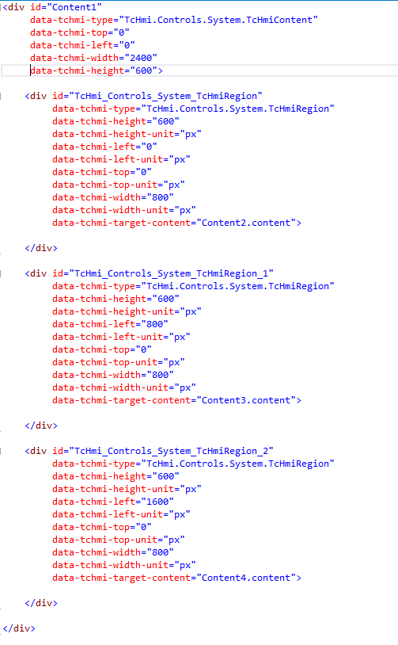

# SwipeContentOfRegion

This sample shows how to create animated content switching in a region which reacts on touch swipe gestures.


## Files

 

### Desktop.view

The region TcHmiRegion in Desktop.view will load Content1.content and provide 3 buttons to jump to the first, second and third content file loaded by regions within Content1.content. 

The region has a width of 800px and a height of 600px and should show content based on this resolution.

### Content1.content

 

Content1.content has a height of 600px and a width of 2400px (800px * 3) because we wan't to load 3 additional content files in additional regions on it.

TcHmiRegion_1 will load Content2.content, TcHmiRegion_2 will load Content3.content and TcHmiRegion_3 will load Content4.content.

Each region in Content1.content has a height of 600px and a width of 800px and those regions are placed next to each other. 
The plan is to load this file into the region on Desktop.view and move the left offset animated to achieve the goal of animated content switching.

 


### Content2.content

Just a content dummy with a width of 800px and a height of 600px to fit into the viewport of the main region on Desktop.view.

### Content3.content

Just a content dummy with a width of 800px and a height of 600px to fit into the viewport of the main region on Desktop.view.

### Content4.content

Just a content dummy with a width of 800px and a height of 600px to fit into the viewport of the main region on Desktop.view.

### CodeBehindTs1.ts

Contains the logic for setting the offset of Content1.content which is loaded in the main region in Desktop.view.
```` js
        // Used to store current animation view for determination what is next view.
        let focusIndex = 0;
        // Used to store TcHmiContent object from Region1 for manipulation.
        let content1 = null;
        // Used to match onTouchMove results with onTouchStart result for determination if animation should be started.
        let touchEventStart = null;
        // Used to destroy onTouchMove event
        let destroyEventTouchMove = null;
        // Btn1 - Sets left position of Content1 to move left region on Content1 into focus.
        TcHmi.EventProvider.register('Btn1.onPressed', (e, data) => {
            if (!content1) {
                return;
            }
            focusIndex = 0; // Left region on Content1 is now in focus. 
            content1.setLeft(0); // Set left to 0 to get first region on Content1 into focus.
        });
        // Btn2 - Sets left position of Content1 to move middle region on Content1 into focus.
        TcHmi.EventProvider.register('Btn2.onPressed', (e, data) => {
            if (!content1) {
                return;
            }
            focusIndex = 1; // Middle region on Content1 is now in focus. 
            content1.setLeft(-800); // Set left to -800 to get middle region on Content1 into focus.
        });
        // Btn3 - Sets left position of Content1 to move right region on Content1 into focus.
        TcHmi.EventProvider.register('Btn3.onPressed', (e, data) => {
            if (!content1) {
                return;
            }
            focusIndex = 2; // Right region on Content1 is now in focus. 
            content1.setLeft(-1600); // Set left to -1600 to get middle region on Content1 into focus.
        });
        // Fetch Content1 object if available in DOM.
        TcHmi.EventProvider.register('Content1.onAttached', (e, data) => {
            content1 = data;
        });
        // Reset content1 if Content1 is no longer available in the DOM.
        TcHmi.EventProvider.register('Content1.onDetached', (e, data) => {
            content1 = null;
        });
        // Store TouchEvent on onTouchStart event and register ononTouchMove event.
        TcHmi.EventProvider.register('Content1.onTouchStart', (e, data) => {
            touchEventStart = data;
            if (destroyEventTouchMove) {
                destroyEventTouchMove();
                destroyEventTouchMove = null;
            }
            destroyEventTouchMove = TcHmi.EventProvider.register('Content1.onTouchMove', (e, data) => {
                if (!touchEventStart) {
                    return;
                }
                let deltaX = data.touches[0].clientX - touchEventStart.touches[0].clientX; // Calculate how far touch (finger) was moved since onTouchStart.
                let limit = 20; // Used to determine how far the touch (finger) has to be moved to trigger animation.
                switch (focusIndex) {
                    case 0: // Left region on Content1 is in focus
                        if (deltaX < -limit) { // Move to the left to get middle region on Content1 into focus.
                            focusIndex = 1;
                            content1 === null || content1 === void 0 ? void 0 : content1.setLeft(-800);
                            // Content moved into focus. Destroy onTouchMove event to avoid further move actions for this touch interaction.
                            if (destroyEventTouchMove) {
                                destroyEventTouchMove();
                                destroyEventTouchMove = null;
                            }
                        }
                        break;
                    case 1: // Middle region on Content1 is in focus
                        if (deltaX < -limit) { // Move to the left to get right region on Content1 into focus.
                            focusIndex = 2;
                            content1 === null || content1 === void 0 ? void 0 : content1.setLeft(-1600);
                            // Content moved into focus. Destroy onTouchMove event to avoid further move actions for this touch interaction.
                            if (destroyEventTouchMove) {
                                destroyEventTouchMove();
                                destroyEventTouchMove = null;
                            }
                        }
                        else if (deltaX > limit) { // Move to the right to get left region on Content1 into focus.
                            focusIndex = 0;
                            content1 === null || content1 === void 0 ? void 0 : content1.setLeft(0);
                            // Content moved into focus. Destroy onTouchMove event to avoid further move actions for this touch interaction.
                            if (destroyEventTouchMove) {
                                destroyEventTouchMove();
                                destroyEventTouchMove = null;
                            }
                        }
                        break;
                    case 2: // Right region on Content1 is in focus
                        // Move to the right to get middle region on Content1 into focus.
                        if (deltaX > limit) {
                            focusIndex = 1;
                            content1 === null || content1 === void 0 ? void 0 : content1.setLeft(-800);
                            // Content moved into focus. Destroy onTouchMove event to avoid further move actions for this touch interaction.
                            if (destroyEventTouchMove) {
                                destroyEventTouchMove();
                                destroyEventTouchMove = null;
                            }
                        }
                        break;
                }
            });
        });
````


### CssBehind.css

Contains css definition for animated transition of Content1.

 