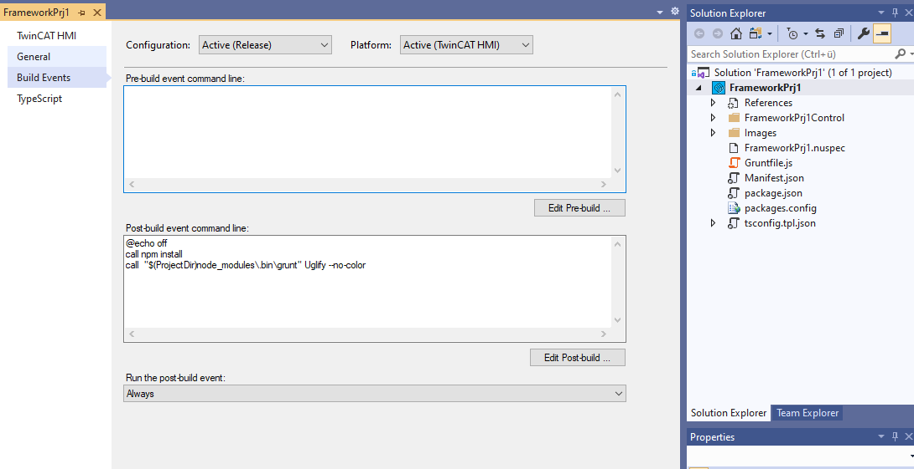
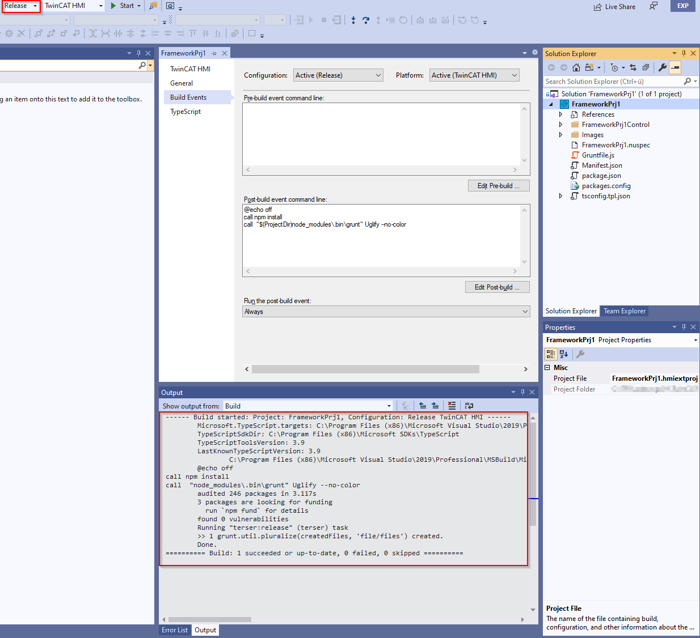

# Uglify JavaScript in a Framework Project

This sample shows how to uglify JavaScript files during build with help of [Node.js](https://nodejs.org/en/) , [Grunt Task-Runner](https://www.npmjs.com/package/grunt) and [Terser](https://www.npmjs.com/package/terser).

## Setup Node.js, Grunt, Terser

Node.js is supplied together with TwinCAT HMI and manual installation is therefore not necessary.

If you need a newer version for whatever reason, you can download it from [here](https://nodejs.org/en/).

### package.json

We have to create a package.json file with at least the following configuration to be able to fetch the required npm (Node Package Manager) packages.

````json
{
  "private": true,
  "devDependencies": {
    "grunt": "1.0.4",
    "grunt-cli": "1.3.2",
    "grunt-terser": "2.0.0",
    "terser": "5.14.2",
  }
}
````

If we call `npm install` within the directory where the package.json is stored the defined dependencies will be downloaded to `node_modules` by npm.

### Gruntfile.js

We have to create a [Gruntfile.js](https://gruntjs.com/getting-started#the-gruntfile) for configuration of our [Terser](https://www.npmjs.com/package/terser) [Grunt](https://www.npmjs.com/package/grunt) task.

````js
/**
 * 
 * @param {IGrunt} grunt Grunt object 
 */
module.exports = function (grunt) {
    // Grunt build configuration.
    grunt.initConfig({
        // General
        pkg: grunt.file.readJSON('package.json'),
        // Task: 'terser'
        terser: {
            release: {
                options: {
                    output: {
                        beautify: false,
                    }
                },
                files: {
                    'FrameworkPrj1Control/FrameworkPrj1Control.js': ['FrameworkPrj1Control/FrameworkPrj1Control.js'],
                }
            }
        }
    });

    // Load npm tasks 
    grunt.loadNpmTasks('/grunt-terser');

    // Register grunt tasks
    grunt.registerTask('Uglify', [
        'terser:release',
    ]);
};
````

### Hint
#### Avoid unwanted files in nuget packages

````xml
<?xml version="1.0" encoding="utf-8"?>
<package>
  <metadata>
    <id>FrameworkPrj1</id>
    <version>1.0.0</version>
    <description>-.-</description>
    <authors></authors>
    <title>FrameworkPrj1</title>
    <owners></owners>
    <projectUrl>http://PROJECT_URL_HERE_OR_DELETE_THIS_LINE</projectUrl>
    <releaseNotes>Summary of changes made in this release of the package.</releaseNotes>
    <copyright>Copyright 2020</copyright>
    <tags>TwinCAT HMI</tags>
    <dependencies>
      <group targetFramework="native1.12-tchmi">
        <dependency id="Beckhoff.TwinCAT.HMI.Framework" version="12.734.0-beta" />
      </group>
    </dependencies>
  </metadata>
  <files>
    <file src="**\*" target="runtimes\native1.12-tchmi\" exclude="**\*\node_modules\**\*;**\*.ts;**\*.js.map;\**\*.nuspec;**\*.tpl.json;**\*.hmi*proj;**\~*;**\*.tmp;**\tmp*;**\*.user;**\tsconfig.json;**\*.log;**\*.bak;**\obj\**\*;packages.config;packages.xsd;.hmiframework\**\*;.git;.gitignore;.gitattributes" />
	<file src="images\logo.png" target="images\" />
  </files>
</package>
````

We add the following rules to the top file specification in the *.nuspec file of the project to avoid unwanted files to be added to the resulting NuGet package.

````
**\*\node_modules\**\*;**\*.ts;**\*.js.map;
````

This will exclude everything within a node_modules directory and the node_modules directory itself, the TypeScript source (*.ts) and definition (*.d.ts) files which are only required for debugging and development and the generated JavaScript map (*.js.map) files which are also required for debug only.

## Run Terser Grunt Task on build

On the Properties-Page (Right click on the project node -> Properties) of the TwinCAT HMI Framework Project you have the possibility to define build event command line scripts.

* Pre-build event command line scripts will be processed before the build starts.
* Post-build event command line scripts will be processed after the build has finished.



To uglify our JavaScript files on each Release build we define the following script in the Post-build event command line area.

````bat
@echo off
call npm install
call  "$(ProjectDir)node_modules\.bin\grunt" Uglify --no-color
````

The script will call `npm install` to make sure all all required node modules do exist and then it will call grunt within the local node_modules directory with the name of our defined grunt task. Grunt will now process this task and the task will process the terser job based on the terser:release configuration we made in Gruntfile.js.

All we have to do now is to select the Release build configuration and build the project.


