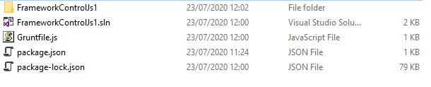
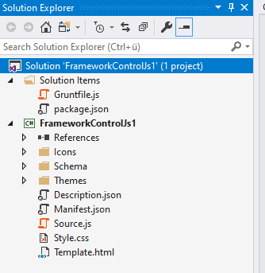
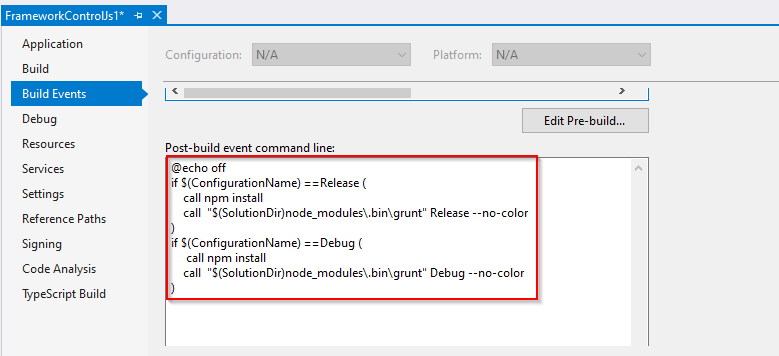
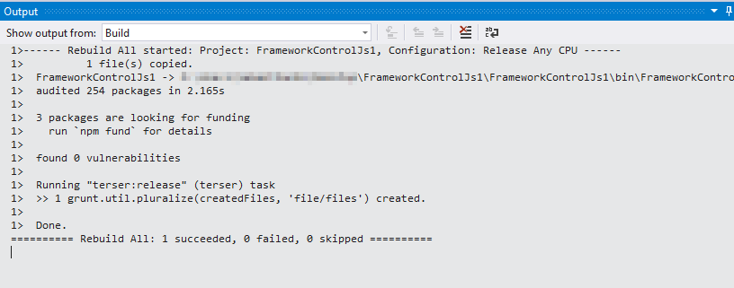
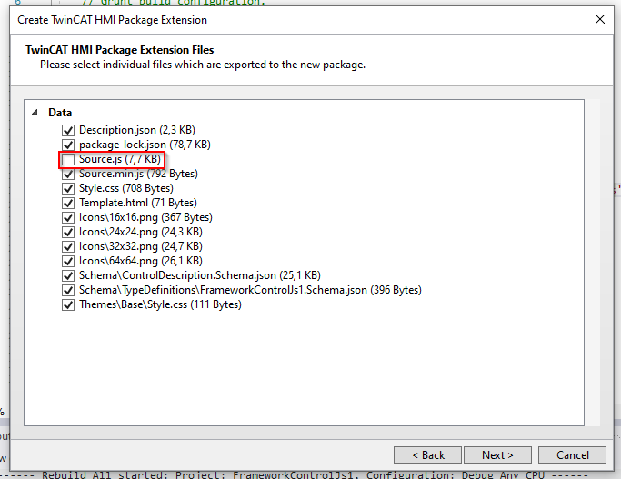

# Uglify JavaScript in a Framework Project

This sample shows how to uglify JavaScript files during build with help of [Node.js](https://nodejs.org/en/) , [Grunt Task-Runner](https://www.npmjs.com/package/grunt) and [Terser](https://www.npmjs.com/package/terser).

## Setup Node.js, Grunt, Terser

You can check if [Node.js](https://nodejs.org/en/) is already installed if you open a command prompt and enter this:<br />
````
node --version
````
It will either result in a version string like this `v12.18.0` or it will let you know that node is not known.<br />
We recommend to use an actual LTS variant of [Node.js](https://nodejs.org/en/). The sample has been creaated and tested based on version `12.18.0`.<br />
You can download it from [here](https://nodejs.org/en/).

### package.json

We have to create a package.json file with at least the following configuration to be able to fetch the required npm (Node Package Manager) packages.

````json
{
  "private": true,
  "devDependencies": {
    "grunt": "1.0.4",
    "grunt-cli": "1.3.2",
    "grunt-terser": "1.0.0",
    "grunt-contrib-copy": "1.0.0"
  }
}

````

If we call `npm install` within the directory where the package.json is stored the defined dependencies will be downloaded to node_modules by npm (Node Package Manager).

### Gruntfile.js

We have to create a [Gruntfile.js](https://gruntjs.com/getting-started#the-gruntfile) for configuration of our [Terser](https://www.npmjs.com/package/terser) [Grunt](https://www.npmjs.com/package/grunt) task.


````js
/**
 * 
 * @param {IGrunt} grunt Grunt object 
 */
module.exports = function (grunt) {
    // Grunt build configuration.
    grunt.initConfig({
        // General
        pkg: grunt.file.readJSON('package.json'),
        // Task: 'terser'
        terser: {
            release: {
                options: {
                    output: {
                        beautify: false,
                    }
                },
                files: {
                    'FrameworkControlJs1/Source.min.js': ['FrameworkControlJs1/Source.js'],
                }
            }
        },
        // Task: 'copy'
        copy: {
            debug: {
                files: {
                    'FrameworkControlJs1/Source.min.js': ['FrameworkControlJs1/Source.js'],
                }
            },
        },
    });

    // Load npm tasks 
    grunt.loadNpmTasks('/grunt-terser');
    grunt.loadNpmTasks('/grunt-contrib-copy');

    // Register grunt tasks
    grunt.registerTask('Release', [
        'terser:release',
    ]);

    grunt.registerTask('Debug', [
        'copy:debug',
    ]);
};
````

### Hint

It is better to store this file outside of the project directory to avoid a listing for the package generation of these files. We don't want those files in the hmi package and we don't want to manually unselect them while generating the package.



But we can still add these files to the Solution as Solution Items to be able to maintain them next to our package project.



## Update Description.json

Update the Description.json to use Source.min.js instead of the original Source.js file.

````json
{
...
  "dependencyFiles": [
    {
      "name": "Source.min.js",
      "type": "JavaScript",
      "description": "Contains all the main logic."
    },
    {
      "name": "Style.css",
      "type": "Stylesheet",
      "description": "Theme independent style"
    }
  ],
...
}
````

## Run Terser or Copy Grunt Task on build

On the Properties-Page (Right click on the project node -> Properties) of the TwinCAT HMI Framework Project you have the possibillity to define build event command line scripts.<br />
* Pre-build event command line scripts will be processed before the build starts.
* Post-build event command line scripts will be processed after the build has finished.



To uglify our JavaScript files on each Release build and copy the original code on each Debug build we define the following script in the Post-build event command line area.<br />

````bat
@echo off
if $(ConfigurationName) ==Release (
    call npm install
    call  "$(SolutionDir)node_modules\.bin\grunt" Release --no-color
)
if $(ConfigurationName) ==Debug (
     call npm install
    call  "$(SolutionDir)node_modules\.bin\grunt" Debug --no-color
)
````

The script will call `npm install` to make sure all all required node modules do exist and then it will call grunt within the local node_modules directory with the name of one of our defined grunt tasks. Grunt will now process this task and the task will process the underlying tasks configured in Gruntfile.js. A build with Release configuration will lead to a uglified variant of Source.js which is called Source.min.js and a build with Debug configuration will lead to a Source.min.js file which is just a copy of the original Source.js for Debug purposes.

All we have to do now is to select the Release build configuration and build the project.



### Hint

Do not forget to unselect the original Source.js while creating the TwinCAT HMI Package if you do not want to share your original sourcecode.

